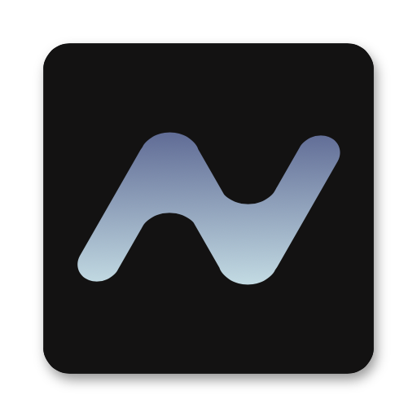

<p align="center">
  <picture>
    
  </picture>
</p>

<p align="center">
  <strong>NeoWatch API</strong> — REST API for streaming movies and TV shows.
</p>

<p align="center">
  <a href="https://vercel.com/new/clone?repository-url=https%3A%2F%2Fgithub.com%2FNeo-Open-Source%2Fneowatch-api&project-name=neowatch-api">
    
  </a>
  <a href="https://app.netlify.com/start/deploy?repository=https://github.com/Neo-Open-Source/neowatch-api">
    
  </a>
</p>

<div align="center">

[](LICENSE)
[](https://www.typescriptlang.org/)
[](https://bun.sh/)
[](https://elysiajs.com/)
[](https://www.prisma.io/)
[](https://www.postgresql.org/)

</div>

---

## Features

- **Movies & TV** — Details, credits, recommendations, similar, collections
- **Search** — Multi-source search with TMDB integration
- **User Data** — Favorites, watch later, cross-device sync
- **Video Players** — Alloha, Collaps, CDN, HLS proxy
- **Authentication** — Neo ID SSO (OAuth 2.0 + OpenID Connect)
- **Images** — TMDB image proxy with caching
- **Torrents** — Search via RedAPI
- **Admin** — Cron-based IMDb ratings sync
- **API Versioning** — v1 with consistent JSON envelope

## Stack

| Category | Technology |
|----------|-----------|
| Runtime | [Bun](https://bun.sh/) 1.x |
| Framework | [Elysia](https://elysiajs.com/) 1.x |
| Database | [PostgreSQL](https://www.postgresql.org/) 16 (Neon) |
| ORM | [Prisma](https://www.prisma.io/) 6 |
| Auth | [Neo ID](https://id.neo-team.dev) (SSO, OAuth 2.0, OIDC) |
| Metadata | [TMDB](https://www.themoviedb.org/) API v3 |
| Images | TMDB image proxy with CDN caching |
| Deployment | [Vercel](https://vercel.com/) (serverless functions) |
| Docs | [Docusaurus](https://docusaurus.io/) 3 + [Scalar](https://scalar.com/) API Reference |

## Getting Started

### Prerequisites

- [Bun](https://bun.sh/) 1.x
- PostgreSQL 16 (local or [Neon](https://neon.tech/))

### Setup

```bash
# Clone the repository
git clone https://github.com/neo-team/neowatch-api-ts.git
cd neowatch-api-ts

# Copy environment variables
cp .env.example .env
# Edit .env with your configuration

# Install dependencies
bun install

# Generate Prisma client and run migrations
bun run db:generate
bun run db:migrate

# Start development server
bun run dev
```

### Environment Variables

| Variable | Required | Description |
|----------|----------|-------------|
| `DATABASE_URL` | Yes | PostgreSQL connection string |
| `TMDB_API_KEY` | Yes | TMDB API v3 key |
| `TMDB_ACCESS_TOKEN` | Yes | TMDB API v4 access token |
| `NEO_ID_CLIENT_ID` | Yes | Neo ID OAuth client ID |
| `NEO_ID_CLIENT_SECRET` | Yes | Neo ID OAuth client secret |
| `NEO_ID_REDIRECT_URI` | Yes | OAuth callback URL |
| `PUBLIC_API_URL` | No | Public API base URL |
| `REDAPI_URL` | No | Torrent search API URL |
| `ALLOHA_TOKEN` | No | Alloha player token |
| `COLLAPS_TOKEN` | No | Collaps player token |
| `CDN_TOKEN` | No | CDN player token |
| `CDN_PL` | No | CDN player license key |
| `CRON_SECRET` | No | Cron job authentication secret |

## API Overview

Base URL: `https://neowatch-api.vercel.app/api/v1`

All responses use a consistent JSON envelope:

```json
{
  "success": true,
  "data": { ... }
}
```

Error responses:

```json
{
  "success": false,
  "error": "Description of what went wrong"
}
```

### Endpoints

| Method | Path | Description |
|--------|------|-------------|
| **Auth** | | |
| GET | `/auth/login` | Get Neo ID authorization URL |
| GET | `/auth/callback` | OAuth callback handler |
| GET | `/auth/mobile-callback` | Mobile OAuth callback |
| POST | `/auth/refresh` | Refresh access token |
| GET | `/auth/profile` | Get current user profile |
| PUT | `/auth/profile` | Update user profile |
| GET | `/auth/refresh-tokens` | List active refresh tokens |
| POST | `/auth/refresh-tokens/revoke` | Revoke a refresh token |
| POST | `/auth/refresh-tokens/revoke-all` | Revoke all refresh tokens |
| POST | `/auth/logout` | Logout |
| DELETE | `/auth/account` | Delete account |
| **Movies** | | |
| GET | `/movie/:id` | Movie details |
| GET | `/movie/:id/credits` | Movie credits |
| GET | `/movie/:id/collection` | Movie collection |
| GET | `/movie/:id/recommendations` | Movie recommendations |
| GET | `/movie/:id/similar` | Similar movies |
| GET | `/movie/popular` | Popular movies |
| GET | `/movie/top-rated` | Top rated movies |
| GET | `/movie/upcoming` | Upcoming movies |
| **TV** | | |
| GET | `/tv/:id` | TV show details |
| GET | `/tv/:id/credits` | TV show credits |
| GET | `/tv/:id/season/:season` | Season details |
| GET | `/tv/:id/season/:season/episode/:episode` | Episode details |
| GET | `/tv/:id/recommendations` | TV recommendations |
| GET | `/tv/:id/similar` | Similar TV shows |
| GET | `/tv/popular` | Popular TV shows |
| GET | `/tv/top-rated` | Top rated TV shows |
| **Search** | | |
| GET | `/search` | Multi-source search |
| **Categories** | | |
| GET | `/categories` | Browse categories |
| GET | `/collection/:slug` | Category collection |
| **Genres** | | |
| GET | `/genre/movies` | Movie genres |
| GET | `/genre/tv` | TV genres |
| **Players** | | |
| GET | `/player/alloha/tmdb/:tmdbId` | Alloha player by TMDB ID |
| GET | `/player/alloha/kp/:kpId` | Alloha player by KP ID |
| GET | `/player/collaps/kp/:kpId` | Collaps player by KP ID |
| GET | `/player/cdn/:cdnId` | CDN player |
| GET | `/player/cdn/imdb/:imdbId` | CDN player by IMDb ID |
| **User Data** | | |
| GET | `/favorites` | List favorites |
| POST | `/favorites/:mediaId` | Add favorite |
| DELETE | `/favorites/:mediaId` | Remove favorite |
| GET | `/favorites/:mediaId/check` | Check if favorited |
| GET | `/watch-later` | List watch later |
| POST | `/watch-later/:mediaId` | Add to watch later |
| DELETE | `/watch-later/:mediaId` | Remove from watch later |
| GET | `/watch-later/:mediaId/check` | Check if in watch later |
| GET | `/sync/progress` | Get sync progress |
| PUT | `/sync/progress` | Upsert sync progress |
| DELETE | `/sync/progress` | Delete sync progress |
| POST | `/sync/progress/batch` | Batch upsert progress |
| **Other** | | |
| GET | `/images/tmdb` | TMDB image proxy |
| GET | `/images/backdrop` | Backdrop images |
| GET | `/images/still` | Still images |
| GET | `/support` | Supporters list |
| GET | `/torrents/search` | Torrent search |
| GET | `/health` | Health check |

## Development

```bash
# Start dev server with hot reload
bun run dev

# Run tests
bun test

# Type check
bun run typecheck

# Format code
bunx biome check --write src/

# Lint
bunx biome lint src/

# Build for production
bun run build
```

## Deployment

### Vercel

The project is configured for Vercel deployment via `vercel.json`. All routes are rewritten to the serverless entrypoint at `api/handler.ts`.

```bash
vercel deploy
```

See [docs/deployment.md](docs/docs/deployment.md) for detailed deployment instructions.

## Project Structure

```
src/
  index.ts              # Server entrypoint (Bun.serve)
  app.ts                # Elysia app setup + route mounting
  config.ts             # Environment config
  db.ts                 # Prisma client singleton
  types/                # TypeScript type definitions
    api.ts              #   API response DTOs
    tmdb.ts             #   TMDB API types
  lib/                  # Utilities
    errors.ts           #   Error classes
    response.ts         #   Response helpers
    jwt.ts              #   JWT verification
    mappers.ts          #   TMDB → API mappers
    query.ts            #   Query param helpers
    language.ts         #   Language handling
    images.ts           #   Image size constants
  middleware/
    auth.ts             # Auth middleware
  routes/               # Route handlers (one per domain)
  services/             # Business logic / external API clients
  __tests__/            # Tests
prisma/
  schema.prisma         # Database schema
  migrations/           # Database migrations
docs/                   # Docusaurus documentation site
api/
  index.ts              # Vercel serverless entrypoint
```

## License

[MIT](LICENSE) © Neo Team
