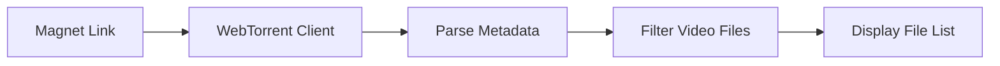
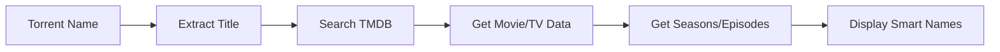
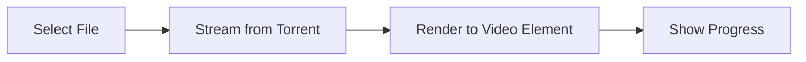

# 🎬 NeoMovies WebTorrent Player

Современный плеер для просмотра торрент файлов прямо в браузере с умной интеграцией TMDB.

## 🚀 Особенности

- ✅ **Полностью клиентский** - все торренты обрабатываются в браузере
- ✅ **Умная навигация** - автоматическое определение сезонов и серий
- ✅ **TMDB интеграция** - красивые названия серий вместо имен файлов
- ✅ **Мультиформат** - поддержка MP4, AVI, MKV, WebM и других
- ✅ **Потоковое воспроизведение** - начинает играть до полной загрузки
- ✅ **Прогресс загрузки** - отображение скорости и процента загрузки

## 📋 API Endpoints

### Открытие плеера
```http
GET /api/v1/webtorrent/player?magnet={MAGNET_LINK}
```
или через заголовок:
```http
GET /api/v1/webtorrent/player
X-Magnet-Link: {MAGNET_LINK}
```

### Получение метаданных
```http
GET /api/v1/webtorrent/metadata?query={SEARCH_QUERY}
```

## 💻 Примеры использования

### 1. Простое открытие плеера
```javascript
const magnetLink = "magnet:?xt=urn:btih:...";
const encodedMagnet = encodeURIComponent(magnetLink);
window.open(`/api/v1/webtorrent/player?magnet=${encodedMagnet}`);
```

### 2. Открытие через заголовок
```javascript
fetch('/api/v1/webtorrent/player', {
    headers: {
        'X-Magnet-Link': magnetLink
    }
}).then(response => {
    // Открыть в новом окне
    window.open(URL.createObjectURL(response.blob()));
});
```

### 3. Получение метаданных
```javascript
fetch('/api/v1/webtorrent/metadata?query=Breaking Bad')
    .then(response => response.json())
    .then(data => {
        if (data.success) {
            console.log('Метаданные:', data.data);
            // data.data содержит информацию о сериале/фильме
        }
    });
```

## 🎮 Управление плеером

### Клавиши управления
- **Space** - пауза/воспроизведение
- **Click** - выбор серии/файла

### UI элементы
- **Информация о медиа** - название, год, описание (верхний левый угол)
- **Список файлов** - выбор серий/частей (нижняя панель)
- **Информация о серии** - название и описание текущей серии
- **Прогресс загрузки** - скорость и процент загрузки

## 🔧 Как это работает

### 1. Загрузка торрента


### 2. Получение метаданных


### 3. Воспроизведение


## 📊 Структура ответа метаданных

### Для фильмов
```json
{
  "success": true,
  "data": {
    "id": 155,
    "title": "Тёмный рыцарь",
    "type": "movie",
    "year": 2008,
    "posterPath": "https://image.tmdb.org/t/p/w500/...",
    "backdropPath": "https://image.tmdb.org/t/p/w500/...",
    "overview": "Описание фильма...",
    "runtime": 152,
    "genres": [
      {"id": 28, "name": "боевик"},
      {"id": 80, "name": "криминал"}
    ]
  }
}
```

### Для сериалов
```json
{
  "success": true,
  "data": {
    "id": 1396,
    "title": "Во все тяжкие",
    "type": "tv",
    "year": 2008,
    "posterPath": "https://image.tmdb.org/t/p/w500/...",
    "overview": "Описание сериала...",
    "seasons": [
      {
        "seasonNumber": 1,
        "name": "Сезон 1",
        "episodes": [
          {
            "episodeNumber": 1,
            "seasonNumber": 1,
            "name": "Пилот",
            "overview": "Описание серии...",
            "runtime": 58
          }
        ]
      }
    ],
    "episodes": [
      {
        "episodeNumber": 1,
        "seasonNumber": 1,
        "name": "Пилот",
        "overview": "Описание серии..."
      }
    ]
  }
}
```

## 🛡️ Безопасность

### ⚠️ ВАЖНО: Клиентский подход
- Торренты обрабатываются **ТОЛЬКО в браузере пользователя**
- Сервер **НЕ ЗАГРУЖАЕТ** и **НЕ ХРАНИТ** торрент файлы
- API используется только для получения метаданных из TMDB
- Полное соответствие законодательству - сервер не участвует в торрент активности

### 🔒 Приватность
- Никакая торрент активность не логируется на сервере
- Магнет ссылки не сохраняются в базе данных
- Пользовательские данные защищены стандартными методами API

## 🌟 Умные функции

### Автоматическое определение серий
Плеер автоматически распознает:
- **S01E01** - формат сезон/серия
- **Breaking.Bad.S01E01** - название с сезоном
- **Game.of.Thrones.1x01** - альтернативный формат

### Красивые названия
Вместо:
```
Breaking.Bad.S01E01.720p.BluRay.x264-DEMAND.mkv
```
Показывает:
```
S1E1: Пилот
```

### Информация о сериях
- Название серии из TMDB
- Описание эпизода
- Продолжительность
- Изображения (постеры)

## 🎯 Примеры интеграции

### React компонент
```jsx
function WebTorrentPlayer({ magnetLink }) {
  const openPlayer = () => {
    const url = `/api/v1/webtorrent/player?magnet=${encodeURIComponent(magnetLink)}`;
    window.open(url, '_blank', 'fullscreen=yes');
  };

  return (
    <button onClick={openPlayer} className="play-button">
      🎬 Смотреть в WebTorrent
    </button>
  );
}
```

### Получение метаданных перед открытием
```javascript
async function openWithMetadata(magnetLink, searchQuery) {
  try {
    // Получаем метаданные
    const metaResponse = await fetch(`/api/v1/webtorrent/metadata?query=${encodeURIComponent(searchQuery)}`);
    const metadata = await metaResponse.json();
    
    if (metadata.success) {
      console.log('Найдено:', metadata.data.title, metadata.data.type);
    }
    
    // Открываем плеер
    const playerUrl = `/api/v1/webtorrent/player?magnet=${encodeURIComponent(magnetLink)}`;
    window.open(playerUrl, '_blank');
    
  } catch (error) {
    console.error('Ошибка:', error);
  }
}
```

## 🔧 Технические детали

### Поддерживаемые форматы
- **Видео**: MP4, AVI, MKV, MOV, WMV, FLV, WebM, M4V
- **Кодеки**: H.264, H.265/HEVC, VP8, VP9
- **Аудио**: AAC, MP3, AC3, DTS

### Требования браузера
- Современные браузеры с поддержкой WebRTC
- Chrome/Edge 45+, Firefox 42+, Safari 11+
- Поддержка WebTorrent API

### Производительность
- Потоковое воспроизведение с первых секунд
- Умное кэширование наиболее просматриваемых частей
- Адаптивная буферизация в зависимости от скорости

## 🚦 Статусы ответов

| Код | Описание |
|-----|----------|
| 200 | Успешно - плеер загружен или метаданные найдены |
| 400 | Отсутствует magnet ссылка или query параметр |
| 404 | Метаданные не найдены в TMDB |
| 500 | Внутренняя ошибка сервера |

---

**🎬 NeoMovies WebTorrent Player** - современное решение для просмотра торрентов с соблюдением всех требований безопасности и законности! 🚀